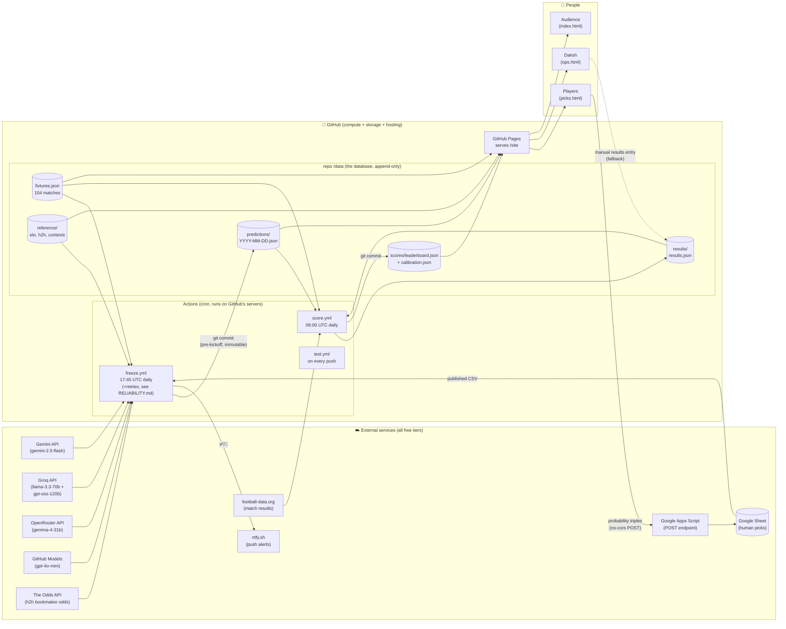
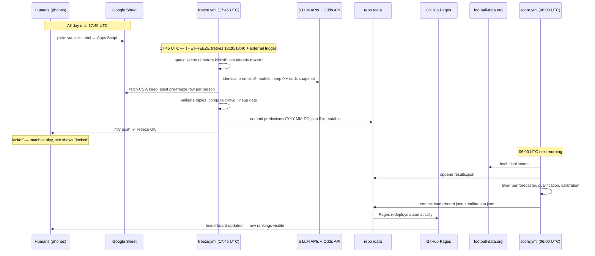
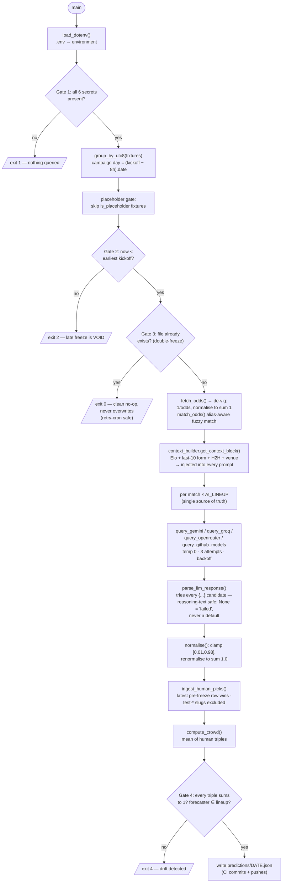
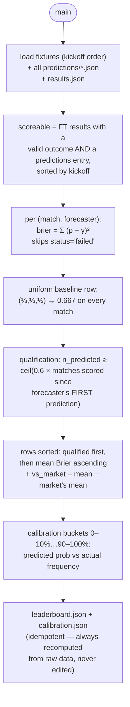

# Architecture — The Forecasting Arena

How every piece talks to every other piece. Diagrams render directly on
GitHub. Zero servers are owned: the entire system is GitHub Actions (compute),
the git repo (database), GitHub Pages (hosting), and free external APIs.

---

## 1. Bird's-eye view

**The key trick**: there is no backend. The git repo *is* the database, commits
*are* the audit log, and the site is static files reading JSON. Your laptop is
never required — both crons run on GitHub's machines.

---

## 2. One campaign day, in time order

---

## 3. freeze.py — internal anatomy (the integrity-critical script)

## 4. score.py — scoring anatomy

---

## 5. Every file, its job, and who calls it

| File | What it does | Reads | Writes | Triggered by |
|---|---|---|---|---|
| `scripts/freeze.py` | Daily prediction freeze: odds + 5 LLMs + human picks → validated, immutable snapshot | fixtures.json, Sheet CSV, 6 APIs, reference/ | predictions/DATE.json | freeze.yml crons 17:45/18:20/18:40 UTC (or manual/external) |
| `scripts/score.py` | Brier scores, qualification, calibration, rankings | predictions/, results.json, fixtures.json | scores/*.json | score.yml cron 06:00 UTC |
| `scripts/fetch_results.py` | Pulls final scores; manual results entry stays first-class fallback | football-data.org | results.json | score.yml (continue-on-error) |
| `scripts/validate_data.py` | Audits the whole /data tree: schemas, sums, referential integrity, lineup membership, freeze-before-kickoff | everything in /data | exit code only | all 3 workflows + every push |
| `scripts/context_builder.py` | Builds Elo/form/H2H/venue context for prompts and the picks-UI intel panels | reference/*.csv,json | reference/match_contexts.json | imported by freeze.py |
| `scripts/apps_script.gs` | Source of the deployed Google Apps Script: appends POSTed picks to the Sheet (append-only by design) | POST body | Google Sheet rows | player submissions |
| `scripts/make_fixtures.py` | One-off: generated the 104-match fixtures.json | hand-curated data | fixtures.json | already done |
| `site/picks.html/.js` | Swipe-card picks app: campaign-day detection, 3-way slider, 3D carousel, localStorage, no-cors POST | fixtures.json, match_contexts.json | Sheet (via Apps Script) | players' browsers |
| `site/index.html` | Public leaderboard | scores/*.json | — | audience browsers |
| `site/ops.html` | Daksh's dashboard: freeze/run/results status + daily checklist | data/*, GitHub API | — | your browser |
| `site/methodology.html` | Pre-registration artifact: the frozen rules | — | — | — |
| `tests/` (52 tests) | Brier math, parsing, ingestion, UTC-8 parity, golden byte-compare pipeline test | tests/golden/, tests/fixtures/ | — | test.yml on every push |

## 6. Secrets — where each credential lives and what touches it

| Secret | Used by | Lives in |
|---|---|---|
| `GEMINI_API_KEY` | freeze.py → Gemini | .env + repo secret |
| `GROQ_API_KEY` | freeze.py → llama-70b **and** gpt-oss-120b | .env + repo secret |
| `OPENROUTER_API_KEY` | freeze.py → gemma | .env + repo secret |
| `GITHUB_TOKEN` | freeze.py → gpt-4o-mini via GitHub Models | PAT in .env; **built-in** in Actions (never appears in the secrets list — provided automatically via `permissions: models: read`) |
| `ODDS_API_KEY` | freeze.py → market forecaster | .env + repo secret |
| `SHEET_CSV_URL` | freeze.py → human picks ingestion | .env + repo secret |
| `FOOTBALL_DATA_API_KEY` | fetch_results.py | .env + repo secret |
| `APPS_SCRIPT_URL` | site/picks.js (baked into the page — it's public by nature) | repo secret kept for reference only; no workflow uses it |

## 7. Design invariants (the "why" behind the shape)

1. **Git is the referee.** A prediction only counts if its commit predates
   kickoff. That's why freeze aborts rather than ever writing late.
2. **One clock for everyone.** Models, market snapshot and humans share the
   17:45 UTC cutoff — nobody gets later information.
3. **Recompute, never edit.** score.py rebuilds everything from raw data on
   each run; corrections go into results.json + CHANGELOG.md, never into
   leaderboard.json by hand.
4. **The UTC−8 campaign day** (`(kickoff − 8h).date()`) keeps late-night US
   kickoffs grouped with their evening siblings. Implemented identically in
   picks.js and freeze.py, locked by a shared test-case file.
5. **Fail loud, fail void.** A model that errors gets `status: failed` for
   that match — never a substituted default. A missed freeze is a missed day
   for everyone equally.
